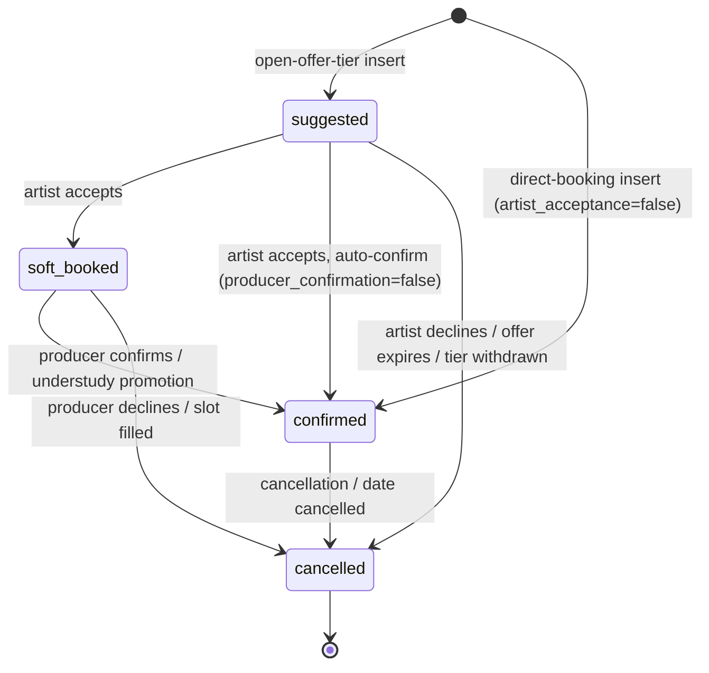
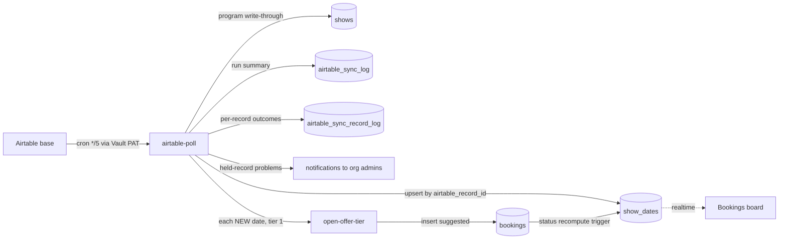
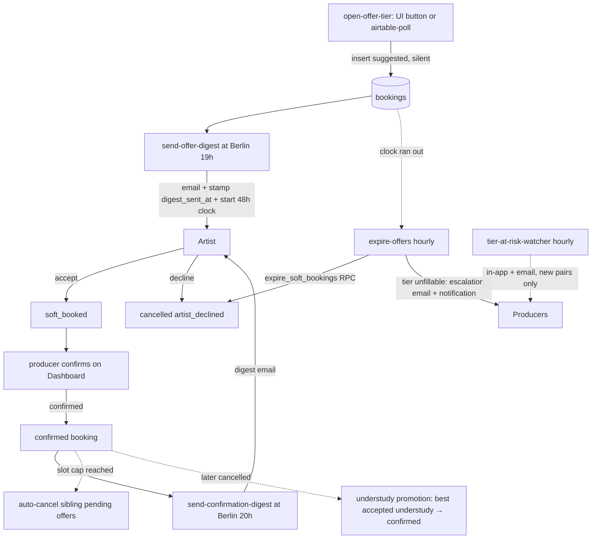

# Showflow Pro — Automation Engine System Map

> **What this is:** the trigger → function → data → side-effect view of the whole automation engine.
> **What this is not:** domain rationale (see `docs/app-logic.md`) or decision history (see `docs/adr/README.md`).
> **Maintenance rule:** any PR that adds or changes a cron job, edge function, DB trigger/RPC/constraint, email, or notification path MUST update this file **and** the in-app graph data `src/data/systemMap.ts` (which powers the Settings → Documentation → System Map canvas) in the same PR. The `systemMap.test.ts` drift guard fails CI when a function/cron label here and there disagree.
> **As of:** 2026-07-15, branch state (not live-project state).

## 1. The engine in one breath

Every 5 minutes, `airtable-poll` copies each org's Airtable base into `show_dates` and, when the org is entitled to the `booking_flow` module, the flow is active (not switched off), and its `booking_flow.auto_open_tier1` and `artist_acceptance` are both on, opens tier-1 offers for any newly imported (or newly-session-ready) date. Opening a tier inserts `suggested` bookings for every eligible, active, unbooked, unblocked artist in that tier's casts, silently by default; no email or notification fires at insert time unless the org uses immediate offer delivery, in which case `open-offer-tier` emails each artist right away instead of waiting for the digest. At the org's configured Berlin evening hour (default 19:00), digest-mode `send-offer-digest` emails each artist their pending offers and **only then** starts the response clock (default 48 h). Artists accept (`soft_booked`, or straight to `confirmed` when the org disables producer review) or decline; every hour, `expire-offers` first reminds artists whose offer expires within 24 h (when the org opts in), then cancels `suggested` offers whose clock ran out and escalates tiers that can no longer fill, either by auto-opening the next tier when the org allows it or by notifying producers to escalate manually; `tier-at-risk-watcher` flags at-risk tiers in-app and, for each newly at-risk recipient, by email too, for orgs that have that alert on. Producers confirm `soft_booked` holds from the dashboard (or book straight to confirmed in direct mode, skipping offers entirely); artists learn of confirmations in the 20:00 digest, when the org keeps that digest on. An admin can pause the entire engine with the `booking_flow.active` master switch (the Settings "Off" state): while off, none of the gated engine paths run (tier-1 auto-open, auto-escalation, expiry reminders, offer and confirmation digests, at-risk alerts) and even a manual `open-offer-tier` is refused, so nothing new is offered, escalated, reminded or digested until it is turned back on. One clock is not frozen: an offer already sent still runs out its response window, because the expiry cancellation (`expire_soft_bookings`) gates on the `booking_flow` module entitlement, not this JSONB switch. The database, not the app, enforces the hard rules: one active booking per artist per date, legal status transitions only, org isolation on every row, auto-cancel when slots fill, understudy auto-promotion (policy-gated) when a confirmed primary cancels. Every email routes through one function (`send-transactional-email`) that checks suppression and per-user preferences before calling Resend, and logs every attempt to `email_send_log`; the Resend webhook `handle-email-suppression` then advances that same log row through the full delivery lifecycle (sent → delivered/delayed/bounced/complained) and upserts `suppressed_emails` on a bounce or complaint. And `cron-health-watcher` checks every 15 minutes that all of the above actually ran, alerting super-admins when it didn't — while its twin, `email-health-watcher`, checks every 15 minutes that email itself is still landing, alerting super-admins in-app (never by email) on a degraded/down transition; `email-log-prune` runs nightly to keep `email_send_log` from growing unbounded.

## 2. Clocks — everything that fires on a schedule

Authoritative definitions: `supabase/migrations/20260624101342_cron_dispatch_timeout.sql` (the original six jobs); `email-health-watcher` added by `20260711000837_email_health_watcher_cron.sql` (same dispatch idiom); `email-log-prune` added by `20260710233405_email_log_prune_and_anonymize.sql` (direct SQL call, no dispatch row — see note below); `health-rollup` added by `20260804181035_health_rollup_cron.sql` (same dispatch idiom, 90s timeout).

| job | schedule | plain English | target function | guard | what it does |
|---|---|---|---|---|---|
| `airtable-poll` | `*/5 * * * *` | every 5 minutes; each org is **gated** by its own `airtable_poll_interval_minutes` (org override → platform default → 5-min floor, 60s grace, read from `airtable_sync_log.synced_at`) — the tick fires every 5 min; orgs on a longer interval skip ticks until their interval elapses | `airtable-poll` | `X-Cron-Secret` only (fan-out path) | Upserts `show_dates` from each active org's Airtable base; opens tier 1 for new dates and for updated dates that just gained a session but have no tier-1 row yet, gated on the org's `booking_flow` entitlement `&& auto_open_tier1 && artist_acceptance`. A second entry point — org-admin **"Sync now"** (`requireOrgRole(admin)` + `org_id`) — syncs one org immediately, bypassing the interval gate (not the tier-1 gate) |
| `offer-digest` | `0 16-19 * * *` | hourly 16:00–19:00 UTC; function itself gates to each org's Berlin hour (default 19:00) | `send-offer-digest` | cron secret or admin/producer JWT | Emails artists their pending offers; stamps `digest_sent_at` and starts `offer_expires_at`. Org list filtered to those entitled to the `booking_flow` module before any per-org work. Skips orgs whose `booking_flow` is direct-booking (`artist_acceptance=false`, no offers exist) or immediate-delivery (`offer_delivery=immediate`, already emailed at open) |
| `confirmation-digest` | `0 17-20 * * *` | hourly 17:00–20:00 UTC; Berlin-hour gate (default 20:00) | `send-confirmation-digest` | cron secret or admin/producer JWT | Emails artists confirmations + schedule changes + cancellations. Org list filtered to those entitled to the `booking_flow` module before any per-org work. Skips the whole org when `booking_flow.confirmation_digest=false` |
| `expire-offers-hourly` | `0 * * * *` | every hour | `expire-offers` | cron secret or admin/producer JWT | Reminder pass and escalation scan are both limited to orgs entitled to the `booking_flow` module. Reminds artists 24 h before an unanswered offer expires (gated on `expiry_reminder`, idempotent via `reminder_sent_at`); expires overdue `suggested` offers via `expire_soft_bookings()`, which itself now carries the same `booking_flow` gate (`AND is_feature_enabled(org_id, 'booking_flow')`) so a lapsed offer in an unentitled org is frozen rather than cancelled; escalates unfillable tiers, auto-opening the next tier and notifying `tier_escalated` when `auto_escalate` is on, else notifying producers to escalate manually |
| `tier-at-risk-hourly` | `5 * * * *` | every hour at :05 | `tier-at-risk-watcher` | cron secret or admin/producer JWT | In-app `tier_at_risk` notifications, plus a best-effort `tier-at-risk` email to the same recipients, when pending + accepted < required slots; the email fires once per newly at-risk (tier, user) pair, not on every run while a tier stays at-risk; gated per org on the `booking_flow` entitlement and `booking_flow.at_risk_alerts`; self-clears on recovery (including for an org that turns the gate, or the entitlement, off) |
| `cron-health-watcher` | `*/15 * * * *` | every 15 minutes | `cron-health-watcher` | cron secret only (empty-role `requireCronOrRole` — the JWT path can never authorize) | Classifies every job healthy/failing/stale; alerts super-admins on confirmed failures (HTTP failures debounced to two consecutive failed observations; staleness on first detection) |
| `email-health-watcher` | `*/15 * * * *` | every 15 minutes | `email-health-watcher` | cron secret only (empty-role `requireCronOrRole`) | Snapshots `email_send_log` deliverability over a lookback window, derives operational/degraded/down, and alerts super-admins in-app on a transition into degraded/down; idempotent via `email_health_state.last_state` |
| `health-rollup` | `7-59/15 * * * *` | every 15 minutes at :07 | `health-rollup` | cron secret only (empty-role `requireCronOrRole`) | Recomputes **today and yesterday** from the Supabase Analytics API into `health_daily` (one row per day per function slug: runs, failures, 4xx rejections, worst status, p95). The Analytics API retains only 24 h, so this is the sole durable source behind the System Health 30-day uptime bar. Recomputes rather than increments (idempotent under double-fire or retry) and aborts without writing when Analytics is unavailable, so an outage cannot punch a permanent hole in the bar |
| `email-log-prune` | `30 3 * * *` | daily at 03:30 | — (no edge function; the pg_cron job body calls `public.prune_email_log()` directly, no `net.http_post` dispatch) | service-role SQL function, no HTTP auth | Deletes `email_send_log` rows older than `email_log_retention_days` (platform `app_settings`, default 90) |
| `prune-airtable-sync-record-log` | `17 3 * * *` | daily at 03:17 | — (no edge function; the pg_cron job body runs a direct `DELETE`, no `net.http_post` dispatch) | service-role SQL, no HTTP auth | Deletes `airtable_sync_record_log` rows older than 30 days, bounding a table `airtable-poll` appends to on every poll (`20260901120000_prune_airtable_sync_record_log.sql`) |

**Dispatch plumbing:** each pg_cron tick runs a SQL wrapper — `net.http_post(...)` to `private.functions_base_url() || '/functions/v1/<fn>'` followed by an `INSERT INTO cron_health_dispatch (job_name, request_id)` — so every dispatch is attributable when `cron-health-watcher` later joins `cron_health_dispatch` → `net._http_response` (`20260623042017_cron_dispatch_capture.sql`). Every call passes `timeout_milliseconds := 30000`: pg_net's 5000 ms default misclassified healthy 3–10 s cold-start responses as `timed_out`, paging super-admins falsely (`20260624101342_cron_dispatch_timeout.sql:1-6`). The `X-Cron-Secret` header value comes from `private.cron_secret()`, which since `20260702120010_cron_secret_to_vault.sql` reads Supabase Vault (no member-readable table holds it); edge functions verify it via the service-role-only `get_cron_secret()` RPC with a constant-time compare (`_shared/auth.ts:14-24,116-146`). The lookup is retried once (`_shared/retry.ts`) because Supabase's API gateway cuts off a small share of REST calls with a 504 after exactly 5 s, a limit we cannot configure; a lookup that still fails returns 503, not 401, so an outage never reads as bad credentials in `cron_health_state` or the `health_daily` unauthorized count. `expire-offers` applies the same single retry to its active-org read and to `expire_soft_bookings()` (idempotent), and its escalation scan filters past show dates in the query itself. The dispatch host is not hardcoded: `private.functions_base_url()` returns the production project host by default and is overridden to the local stack by `seed.sql`, so a non-production stack that runs these migrations (local dev via `npm run local:up`, CI, or a preview branch) never fires its cron or trigger dispatches at production — the same resolver also backs the `dispatch_hire_order_drafts` trigger (`20260809140000_functions_base_url_env_resolver.sql`). `email-health-watcher` follows this exact idiom (net.http_post + cron_health_dispatch row + 30s timeout), so `cron-health-watcher` monitors it like any other job. Two jobs are the exception: `email-log-prune` (calling `public.prune_email_log()`) and `prune-airtable-sync-record-log` (a direct `DELETE`) run their bodies in-database — no HTTP dispatch, no `cron_health_dispatch` row — so both are invisible to `cron-health-watcher`'s classification; their liveness can only be checked via `cron.job_run_details` directly (same blind spot noted in §8 for the watcher's own liveness).

## 3. Buttons — everything a user action fires

Grouped by actor. Full call-site citations live with each row; role gates from `src/App.tsx` + component-level checks.

### Artist (self-service)

| gesture | calls | kind | effect |
|---|---|---|---|
| Availability → toggle a blocked date | inline `blocked_dates` insert/delete — `src/pages/AvailabilityPage.tsx:265,284` | mutation | DB guard `trg_enforce_blocked_date_no_active_booking` rejects blocking a date with an active booking |
| Offer accept / decline (calendar surface Offers lens) | `respondToOffer` — `src/data/bookings.ts:204-220` | mutation | `suggested → soft_booked` or `→ cancelled` (reason `artist_declined`); transition-guarded, notifies producers |
| Profile → Export my data | `export_my_data` RPC — `src/data/account.ts:6` | RPC | Self-scoped GDPR JSON bundle |
| Profile → Delete account | `delete-my-account` — `src/data/account.ts:13` | edge fn | Last-admin guard → `anonymize_user` → auth delete |

### Producer / Admin (org)

| gesture | calls | kind | effect |
|---|---|---|---|
| Show-date sheet → Open tier N | `open-offer-tier` — `src/data/bookings.ts:17` | edge fn | Inserts `suggested` bookings for tier candidates; upserts `show_date_offer_tiers` |
| Show-date sheet → Close tier (± withdraw) | `close-offer-tier` — `src/data/bookings.ts:83` | edge fn | Stamps `closed_at`; withdraw cancels remaining `suggested` offers |
| New show date dialog (opt-in) | `open-offer-tier` auto-call — `src/components/shows/ShowDateFormDialog.tsx:125` | edge fn | Tier 1 opens immediately after manual date creation |
| Dashboard → Confirm / Decline selected | `bulkConfirmSoftBooked` / `bulkDeclineSoftBooked` — `src/data/bookings.ts:138-172` | mutation | `soft_booked → confirmed` / `→ cancelled`; can arm slot-fill auto-cancel and understudy promotion |
| Show-date sheet → per-row confirm/cancel | `updateBookingStatusGuarded` — `src/data/bookings.ts:180-197` | mutation | Same trigger chain, precondition-guarded |
| Admin → Invites → Send / Resend | `create-invitation`, `resend-invitation` — `src/data/invitations.ts:37,104` | edge fn | Insert `org_invitations` + `org-invitation` email |
| Artists page / profile sheet / import → Invite artist | `inviteArtistToApp` — `src/data/invitations.ts:50-55` | edge fn | `create-invitation` with `artist_id` stamped, role forced `artist` |
| Artist import wizard → fetch sheet / commit | `fetch-remote-sheet` — `src/data/remoteSheet.ts:13`; `bulk_import_artists` RPC — `src/data/artistImport.ts:23` | edge fn + RPC | SSRF-guarded CSV fetch; capped, deduped batch insert |
| Admin → People: role toggles / remove | `set_org_member_role`, `remove_org_member` — `src/data/members.ts` | RPC | Last-admin-guarded membership changes; `remove_org_member` now snapshots roles + writes an `org_member_removals` tombstone (and rejects a non-member) so a removed member becomes a "Recently removed" entry |
| Admin → People → Recently removed: Undo / Clear / Delete account | `restore_org_member`, `clear_removed_member`, `list_removed_members`, and the `org-purge-removed-user` edge fn — `src/data/members.ts`, `src/hooks/useOrgMembers.ts` | RPC + edge fn | Undo restores membership + roles (clearing the tombstone via the INSERT trigger); Clear dismisses the tombstone; Delete account anonymizes + auth-deletes, gated to the user's LAST org and never a platform admin |
| Settings → Airtable Sync (pickers, linking) | `airtable-schema` ×4 modes — `src/data/airtableSchema.ts:17-67` | edge fn | Schema/table/linked-record/program-pair reads via Vault PAT |
| Settings → Airtable Sync: key save/status/delete | `set_org_airtable_key`, `get_org_airtable_key_status`, `delete_org_airtable_key` — `src/data/airtableKey.ts:15-35` | RPC | Vault-backed PAT management (decrypted key never client-readable) |
| Settings → Airtable Sync: merge duplicate cities | `merge_cities` — `src/data/cities.ts:65` | RPC | Repoints 4 FK tables to survivor city, deletes losers |
| Settings → Booking Engine → template Preview | `preview-transactional-email` — `src/pages/SettingsPage.tsx:107` | edge fn | Server-side React Email render, no send |
| Settings → Organization → rename | `rename_org` — `src/data/orgs.ts:70` | RPC | Name only, slug immutable |
| Editor mode → View-as picker | `admin-list-users` — `src/features/editor/EditorToolbar.tsx:30` | edge fn | Org-scoped user list (real-admin gate) |
| Productions: slot authoring | `saveShowSlots` → `show_slots` / `show_slot_required_skills` — `ShowFormDialog`, `SlotsStep` (booking-setup rail) | mutation | Named slot rows are the authoring model; `recompute_show_slot_derivations` derives `shows.main_cast_slots`/`understudy_slots` + `show_required_skills`. No app code writes those caches directly. Understudy is optional (a main-only show is configured) |
| Productions / show dialogs: program edits | inline `shows` / `show_dates` writes — `ShowFormDialog`, `ShowDateFormDialog` | mutation | Ripple: status recompute on every child date; cancel cascades to bookings |

### Super-admin (platform)

| gesture | calls | kind | effect |
|---|---|---|---|
| Platform → New organization | `provision-org` — `src/data/platform.ts:93` | edge fn | Atomic `provision_org` RPC + first-admin invite email |
| Platform → org → Export / Delete | `export-org-data` — `src/data/platform.ts:200`; `delete_org` RPC — `:209` | edge fn + RPC | 27-table JSON bundle; hard teardown across the same 27 tables |
| Platform → System Health | `platform-edge-metrics` — `src/data/platform.ts:67`; `get_cron_health` RPC — `:56`; `get_email_health` RPC — `:86` | edge fn + RPC | Analytics-API latency/error metrics; cron dashboard; Email Delivery panel (delivery/bounce/complaint/failure rates, per-template breakdown, recent issues) |
| Platform → Platform Admins tab | `list/add/remove_platform_admin` — `src/data/platform.ts:116-127` | RPC | Roster management, self-demotion + last-admin blocked |
| Platform → org invite popover → Resend | `resend-invitation` — `src/components/platform/OrgInvitePopover.tsx:21` | edge fn | Same invite email, new idempotency key |

### Public (no auth)

| gesture | calls | kind | effect |
|---|---|---|---|
| Email "Unsubscribe" link / page confirm | `handle-email-unsubscribe` — `src/pages/UnsubscribePage.tsx:32,56` | edge fn | Token-credentialed; upserts `suppressed_emails` |
| `/accept-invite?token=` | `exchange-invitation`, then `accept_invitation` — `src/data/invitations.ts` | edge fn + RPC | Stable token is exchanged for a fresh Auth action link; after sign-in, membership + artist link are committed and the invite is consumed |
| Resend deliverability webhook (sent/delivered/delayed/bounce/complaint) | `handle-email-suppression` | webhook | HMAC-verified; updates `email_send_log` lifecycle; bounce/complaint additionally upserts `suppressed_emails` |
| Dormant (not in use since 2026-07): superseded by in-app electronic signing. Documenso `DOCUMENT_COMPLETED` webhook (countersignature done) | `documenso-webhook` | webhook | Shared-secret verified (`X-Documenso-Secret`); `hire_orders.status` `issued → countersigned` + `countersigned_at`; `hire_order_countersigned` notification to producers |
| Customer opens the quote link `/quote/:token` and accepts or declines | `werkbank-quotes` actions `view` and `decide` | edge fn | Token-credentialed (SHA-256 of the link token, no JWT); `decide` stores the accepted PDF and signature, then one `werkbank.record_quote_decision` call writes `quote_acceptances` and the quote status; notifies the office |

## 4. The functions — 27 edge functions at a glance

| function | trigger | auth guard | writes | side effects |
|---|---|---|---|---|
| `airtable-poll` | cron 5-min (per-org interval gate) + org-admin "Sync now" | cron secret only (fan-out) ∨ `requireOrgRole(admin)`+`org_id` (single org, gate bypassed) | `shows`, `show_dates`, `airtable_sync_log`, `airtable_sync_record_log`, `notifications` | invokes `open-offer-tier` for new + updated-ready dates, gated on the `booking_flow` entitlement `&& auto_open_tier1 && artist_acceptance`; Airtable API |
| `open-offer-tier` | UI + `airtable-poll` | service-role ∨ org admin/producer | `bookings` (insert `suggested`), `show_date_offer_tiers`; 403 `feature_disabled` when the org isn't entitled to the `booking_flow` module (JWT callers only, service-role/cron bypasses); 409 instead of any write for direct-booking orgs (`artist_acceptance=false`); `dry_run:true` writes nothing and returns a candidate preview | reads `show_cast_eligibility` (priority ladder + gate), `show_date_cast_eligibility` (gate + tier 99 ad-hoc candidates), `show_required_skills`/`show_date_required_skills`/`artist_skills` (plus an optional per-request `skill_filter_ids`) to resolve the tier; none in digest mode; immediate-delivery orgs (`offer_delivery=immediate`) get an `offer-immediate` email right away, stamped only for sends that succeeded |
| `close-offer-tier` | UI | service-role ∨ org admin/producer | `show_date_offer_tiers`, `bookings` (withdraw); 403 `feature_disabled` when the org isn't entitled to the `booking_flow` module (JWT callers only) | none |
| `expire-offers` | cron hourly + UI | cron secret ∨ admin/producer (reminder pass + escalation scan additionally limited to orgs entitled to the `booking_flow` module, via `filterEntitledOrgs`) | `bookings` (`reminder_sent_at`); `notifications` (`offer_expiring`, `tier_escalated`, `cast_escalation_requested`), `show_date_offer_tiers` (escalation stamp); `expire_soft_bookings()` RPC (itself gated on `is_feature_enabled(org_id, 'booking_flow')`, an independent floor below the edge function's own org filter) → `bookings` | `offer-expiry-reminder` email 24 h before expiry (gated `expiry_reminder`); `auto_escalate` on: auto-opens the next tier of the same effective ladder, no email; else `cast-escalation-requested` email to producers |
| `tier-at-risk-watcher` | cron hourly + UI | cron secret ∨ admin/producer | `notifications` (insert + self-clearing delete); gated per org on the `booking_flow` entitlement and `at_risk_alerts` (stale notifications still clear for a gated or unentitled org) | best-effort `tier-at-risk` email to the same recipients, sent once per newly at-risk (tier, user) pair, not on every run; a failed lookup or send is logged and swallowed, never blocks the notification write or the rest of the scan |
| `generate-hire-orders` | DB trigger `dispatch_hire_order_drafts` (`show_dates.status → fully_filled`, `draft` action) + UI: `draft-manual` from the New order wizard (`NewOrderWizard`, free artist × date pick with manual fields); `issue`/`preview` from the V2 split builder (`HireOrderEditPage`); `issue`/`download-url` from the V4 tracking page's batch-issue bar (`OrdersTable`) and row slide-over (`OrderSlideOver`); `countersign-test` from the Settings countersign card; `sign` from the artist's sign dialog (`SignHireOrderDialog`) on `HireOrderDetailPage` | cron secret (`X-Cron-Secret`) ∨ `requireOrgRole(org_id,[admin,producer])` (JWT, org-scoped); `download-url` has its own bespoke auth — org admin/producer, super-admin, or the linked artist on an issued/countersigned order only; `countersign-test` re-checks admin-only on top of the coarse gate; `sign` has its own bespoke auth too, checked ahead of the coarse gate: the linked artist only (`artists.user_id = caller`), on an `issued` order whose org is in electronic countersign mode | `hire_orders` (insert `draft`, per-booking try/catch; insert `draft-manual`, single row, no booking link; `ready→issued` + `pdf_path` + `issued_pdf_sha256` on `issue`; `countersign_mode`/`documenso_envelope_id` on `issue` when the org's countersign mode is `documenso` and the Documenso call succeeds — falls back to `countersign_mode='manual'` + a `documenso_failed` warning on failure, the already-issued document is never undone); Storage `hire-orders/<org>/<order_no>.pdf` upload (`issue`); `notifications` `hire_orders_ready` (`draft`, once per batch, when `notify:true`) / `hire_order_issued` (`issue`, per artist); on `sign`: `hire_order_signatures` insert (audit row) + `hire_orders` `issued→countersigned` with `signed_pdf_path`/`countersign_mode='electronic'`; Storage `hire-orders/<org>/<order_no>-signed.pdf` + (drawn signatures only) `hire-orders/<org>/signatures/<order_no>.png` | `hire-order-issued` email with PDF attachment, carrying a `signing_url` in documenso mode and in electronic mode (the order's own detail page), best-effort (`issue` only); Documenso REST API create→recipient→distribute (`issue`, documenso mode only) via `_shared/documenso.ts`, and a read-only connectivity check (`countersign-test`) — token read from the `DOCUMENSO_API_TOKEN` edge secret, never returned to the client; gated on `is_feature_enabled(org,'hire_orders')` (default off, ships dark); on `sign`: `hire-order-countersigned` email with the signed PDF to the artist, and to producers too when the org's `email_producers_on_countersign` setting is on; in-app `hire_order_countersigned` notifications to the order's producers (`resolve_show_assignments`, fallback org admins) and a confirmation notification to the signing artist |
| `documenso-webhook` | Dormant (not in use since 2026-07): superseded by in-app electronic signing. Documenso `DOCUMENT_COMPLETED` webhook | shared secret only — constant-time compare of `X-Documenso-Secret` against the Vault-backed `DOCUMENSO_WEBHOOK_SECRET` edge secret; no JWT, no db read before the compare passes | `hire_orders.status` `issued → countersigned` + `countersigned_at` (matched by `documenso_envelope_id`); `notifications` `hire_order_countersigned` to the order's producers (`resolve_show_assignments`, fallback org admins) | none; idempotent — a duplicate delivery on an already-`countersigned` order is a 200 no-op; an unrecognised envelope id or any other event type is acknowledged `{ignored:true}` rather than retried |
| `werkbank-quotes` | UI (quote page: `preview`, `send`, `resend`, `download-url`) + the public quote page (`view`, `decide`) | internal actions: `requireOrgRole(org_id, [admin,producer])` on a handwerk org; `view`/`decide`: the link token only (looked up by its SHA-256), `verify_jwt = false` | `werkbank.quotes` (status, `sent_at`, `sent_to`, `pdf_path`, `pdf_sha256`, `access_token_hash`; service role only, behind the `lock_quote` trigger); `werkbank.quote_acceptances` via the `record_quote_decision` RPC (acceptance row + status in one call); Storage `werkbank-documents` (sent PDF, accepted PDF, drawn signature, all content-addressed); `notifications` `quote_accepted` / `quote_rejected` to every admin and producer of the org | emails `quote-sent` (PDF attached, per recipient), `quote-decided` (office), `quote-decision-confirmation` (customer, accepted PDF attached), all requested in German: German when the org has language packages (the default for Handwerk), else the English base copy; best-effort; a failed email never rolls a send or a decision back |
| `send-offer-digest` | cron hourly (Berlin gate) + UI | cron secret ∨ admin/producer | `bookings` (`digest_sent_at`, `offer_expires_at`); org list filtered to those entitled to the `booking_flow` module; skips immediate-delivery and direct-booking orgs | `artist-offer-digest` email |
| `send-confirmation-digest` | cron hourly (Berlin gate) + UI | cron secret ∨ admin/producer | `notifications`, `show_date_change_log` (`digested_at`), `bookings` (`confirmation_digest_sent_at`); org list filtered to those entitled to the `booking_flow` module; skipped entirely when `confirmation_digest=false` | `artist-confirmation-digest` email |
| `send-transactional-email` | fn→fn only | service-role only | `email_unsubscribe_tokens`, `email_send_log` | Resend API (idempotency-keyed) |
| `preview-transactional-email` | UI | `requireRole(admin,producer)` (gateway JWT off — see §Open questions) | none | render only |
| `handle-email-suppression` | Resend webhook | HMAC signature (Standard Webhooks) | `email_send_log` (full lifecycle: sent/delivered/delivery_delayed/bounced/complained, matched by `resend_id`), `suppressed_emails` (bounce/complaint only) | none |
| `handle-email-unsubscribe` | public link | unsubscribe token | `email_unsubscribe_tokens` (atomic use), `suppressed_emails` | none |
| `airtable-schema` | UI | org admin | none | Airtable Meta/Data API |
| `create-invitation` | UI | org admin | `org_invitations` | `org-invitation` email carrying the stable app invitation URL |
| `exchange-invitation` | public invitation page | stable invitation token; `verify_jwt=false` | `claim_invitation_auth_exchange` stamps the exchange cooldown; a failed Auth mint conditionally clears only that exact stamp | Supabase Admin API mints a fresh one-time Auth action link |
| `resend-invitation` | UI | org admin (disclosure-safe 403) | `renew_invitation_for_resend` restarts the invitation window and clears exchange cooldown | `org-invitation` email carrying the stable app invitation URL |
| `admin-list-users` | UI | org admin | none | none |
| `provision-org` | UI | super-admin | `provision_org` RPC → org + catalog + invite | `org-invitation` email |
| `export-org-data` | UI | super-admin | none | none |
| `platform-edge-metrics` | UI | super-admin | none | Supabase Analytics API |
| `delete-my-account` | UI | own JWT | `anonymize_user` RPC; `auth.admin.deleteUser` | none |
| `org-purge-removed-user` | UI | org admin | `admin_anonymize_removed_user` RPC → `auth.admin.deleteUser` — only for a removed member's LAST org and never a platform admin; else no-op (`retained`) | none |
| `fetch-remote-sheet` | UI | org producer/admin | none | SSRF-guarded fetch of docs.google.com CSV |
| `cron-health-watcher` | cron 15-min | cron secret only | `cron_health_state`, `cron_health_log`, `notifications`; prunes dispatch/log | `cron-health-alert` email |
| `email-health-watcher` | cron 15-min | cron secret only | `email_health_state` (last_state, last_alerted_at); `notifications` `email_health_degraded` on fresh transition only | none — in-app only by design (email is the thing being monitored) |

### Booking engine — `open-offer-tier`, `close-offer-tier`, `expire-offers`, `tier-at-risk-watcher`

Tier N (1…) = the effective ladder for that (show, city): `show_cast_eligibility` priority rows for the date's city win outright when present (the org-wide list is ignored for that pair), else the ladder is the org-wide `cast_city_priority` list; tier 99 = ad-hoc casts added via `show_date_cast_eligibility` minus any cast already in that effective ladder (prevents double-offering). Candidates = active artists in those casts, minus anyone already actively booked on the date, minus anyone with a `blocked_dates` row, minus anyone outside the show eligibility gate (union of `show_cast_eligibility` and `show_date_cast_eligibility` rows for the date, no rows at all means unrestricted), minus anyone missing a required skill (`show_required_skills` union `show_date_required_skills`, plus an optional per-open `skill_filter_ids` filter that only a manual open or dry run may pass, never automation). An org not entitled to the `booking_flow` module gets a 403 `feature_disabled` from `open-offer-tier` and `close-offer-tier` on the JWT path (service-role/cron callers bypass this check and are gated separately, per function, below); `expire-offers`' reminder pass and auto-escalation, and `tier-at-risk-watcher`'s whole scan, are limited to entitled orgs before any of the logic below runs. Direct-booking orgs (`booking_flow.artist_acceptance=false`) get a 409 instead of an open: offers are disabled entirely, and producers book straight to `confirmed`. A `dry_run:true` body returns the candidate list plus exclusion counts (`already_booked`/`blocked`/`inactive`/`not_eligible`/`missing_skills`) without writing anything. All offers are primary (`is_understudy: false`); understudy slots never get automated offers, and `understudy_slots` is excluded from the fill math (`_shared/tierFill.ts:34-46`). `offer_expires_at` is not written by the insert itself: digest-mode orgs wait for `send-offer-digest` to stamp it when the daily email actually sends, while immediate-delivery orgs (`offer_delivery=immediate`) email each offer right away and stamp `digest_sent_at`/`offer_expires_at` moments later in the same call, only for the offers whose `offer-immediate` email delivered. `expire-offers` also runs a 24 h-before-expiry reminder pass ahead of escalation (`offer-expiry-reminder` email + `offer_expiring` in-app, `reminder_sent_at` idempotency, gated on `expiry_reminder`). Escalation fires once per tier (`escalation_notified_at` stamp) when zero pending non-expired offers remain and accepted < required: with `auto_escalate` on, it closes the short tier and opens the next tier of the SAME effective ladder that opened it automatically (`tier_escalated` notification, no email); otherwise, or if that auto-open invoke fails, it falls back to notifying producers to escalate manually (`cast-escalation-requested`). At-risk flagging (`tier-at-risk-watcher`) is the earlier, softer signal (pending + accepted < required), gated per org on `at_risk_alerts`, and self-heals by deleting its notifications when a tier recovers, closes, or the org turns the gate off; it also emails the same producers (fallback org admins) via `tier-at-risk`, but only once per newly at-risk (tier, user) pair, not on every hourly run, and a failed lookup or send is swallowed so it never blocks the notification write. Cites: `open-offer-tier/index.ts:59-217,271-376`, `close-offer-tier/index.ts:61-90`, `expire-offers/index.ts:23-361`, `tier-at-risk-watcher/index.ts:29-177`.

### Digests & email — `send-offer-digest`, `send-confirmation-digest`, `send-transactional-email`, `preview-transactional-email`, `handle-email-suppression`, `handle-email-unsubscribe`, `email-health-watcher`

Both digests iterate `getActiveOrgs`, then immediately narrow that list with `filterEntitledOrgs` to orgs entitled to the `booking_flow` module — an unentitled org never enters either digest's per-org loop, gets no email, and its `bookings`/`notifications` rows are never touched — before resolving the org's Berlin send-hour via `resolveOrgSetting` and no-opping unless the current Berlin hour matches (the cron fires hourly across a window so summer/winter time both hit). Each digest additionally gates on the org's `booking_flow` config: `send-offer-digest` skips direct-booking (`artist_acceptance=false`) and immediate-delivery (`offer_delivery=immediate`) orgs, and `send-confirmation-digest` skips any org with `confirmation_digest=false`. Recipient resolution is login-email-first via `resolve_user_contacts` (ADR-0011). Stamps are written **only after** `emailWasSent()` confirms Resend accepted — a failed send self-retries next hour because the query keys on the missing stamp. All sends funnel through `send-transactional-email` (service-role callers only), which short-circuits on `suppressed_emails` (fail-closed), checks `should_notify` category×channel prefs (fail-open), mints unsubscribe tokens, logs every attempt to `email_send_log` as a single-row state machine (`pending → sent/failed/suppressed/pref_disabled`), and passes the caller's idempotency key to Resend so retried digest runs can't double-send. Cites: `send-offer-digest/index.ts:21-51,62-140`, `send-confirmation-digest/index.ts:55-255`, `send-transactional-email/index.ts:34-269`.

**Deliverability lifecycle:** the Resend webhook `handle-email-suppression` advances that same `email_send_log` row (matched by `resend_id`) through every subsequent delivery event — `sent → delivered` (or `delivery_delayed`, `bounced`, `complained`) — stamping the matching `*_at` column each time; `email.opened`/`email.clicked` events are acknowledged and ignored. `bounced`/`complained` events additionally upsert `suppressed_emails`, which is what makes the fail-closed suppression check in `send-transactional-email` accurate. If the webhook event arrives before the send row exists (or the row was pruned), it inserts a synthetic fallback row so deliverability counts stay correct rather than silently under-counting. **Health monitoring:** `email-health-watcher` (cron `*/15 * * * *`, mirroring `cron-health-watcher`'s dispatch idiom exactly) calls the `email_health_snapshot(p_window_minutes)` RPC to aggregate delivery/bounce/complaint/failure rates over a lookback window, runs them through the shared `deriveEmailStatus` thresholds (Deno mirror of the frontend's), and — gated on a minimum volume floor so a handful of events can't false-alarm — alerts all super-admins in-app (`email_health_degraded` notification, **no email**: the channel being monitored can't be trusted to carry its own outage alert) only on a transition into degraded/down, tracked idempotently via `email_health_state.last_state`. It aborts (no state write, no alert) rather than guess on any snapshot- or state-read failure, so an outage is never silently recorded as healthy. **Retention:** the separate `email-log-prune` cron (daily `30 3 * * *`) calls `public.prune_email_log()` directly — no edge function — deleting `email_send_log` rows older than the platform `email_log_retention_days` setting (default 90); `anonymize_user` (GDPR erasure) additionally scrubs `email_send_log.recipient_email` to `[anonymized]` for a deleted user's address so old log rows don't retain PII past account deletion. Cites: `handle-email-suppression/index.ts`, `email-health-watcher/index.ts:21-90`, `_shared/emailHealth.ts`, `20260710233405_email_log_prune_and_anonymize.sql`.

### Airtable sync — `airtable-poll`, `airtable-schema`

`airtable-poll` is org-fault-isolated (one org's failure never aborts the others) and idempotent per record via `airtable_record_id`. It resolves linked venue/city records, maps custom fields (`custom_field_definitions`), write-throughs program changes to `shows`, handles cancel/revival status flips, logs every run (`airtable_sync_log`) and every record outcome (`airtable_sync_record_log`), and notifies org admins (`airtable_sync_held`) only on new/worsening held-record problems. New dates, and updated dates that just gained a session but have no tier-1 row yet, go to `open-offer-tier` tier 1, batched 10 at a time, gated on the org's `booking_flow` entitlement `&& auto_open_tier1 && artist_acceptance` (a direct-booking org has no offer step, and `open-offer-tier` now 409s in that mode, so the gate also avoids pointless failing invokes). The cron tick fires every 5 minutes for every active org, but each org is gated by its own `airtable_poll_interval_minutes` (org override → platform default → 5-min floor, with a 60s grace window) — the gate reads the org's most recent `airtable_sync_log.synced_at` and skips the org until the interval has elapsed, so a poll actually only runs on the ticks the org's cadence calls for. A second, scoped entry point on the same function powers an org-admin **"Sync now"** button (Settings → Airtable Sync): `requireOrgRole(admin)` + a single `org_id` in the body syncs that one org immediately, bypassing the interval gate entirely. `airtable-schema` is the read-only mapping helper behind Settings → Airtable Sync; a PAT lacking schema scope degrades to `{schemaAccessible:false}` rather than erroring. Cites: `airtable-poll/index.ts:103-523`, `airtable-schema/index.ts:22-185`.

### Org & platform — `provision-org`, `create-invitation`, `exchange-invitation`, `resend-invitation`, `admin-list-users`, `platform-edge-metrics`, `cron-health-watcher`

Invitation flow: insert `org_invitations` (30-day database authority; token via DB default) → best-effort `org-invitation` email carrying the stable app URL (failure never orphans the invite — admins can copy the link). On Continue, public `exchange-invitation` atomically claims a 60-second slot via `claim_invitation_auth_exchange`, mints a fresh one-time Supabase Auth action link, and conditionally clears that exact claim if minting fails. Resend calls `renew_invitation_for_resend` before delivery, restarting the full 30-day window and clearing the exchange cooldown. `my_has_password` exposes only the authenticated caller's own password-presence boolean. `provision-org` delegates atomicity to the `provision_org` RPC called through the **caller's JWT** so the RPC's own super-admin check holds. `platform-edge-metrics` talks to the Supabase Management/Analytics API (dedicated `ANALYTICS` PAT — project keys can't reach it); it queries `function_edge_logs` by `function_id` and resolves ids to slugs via the functions-list API. Cites: `create-invitation/index.ts`, `exchange-invitation/index.ts`, `resend-invitation/index.ts`, `20260811232407_stable_invitation_auth.sql`, `20260812200000_release_failed_invitation_exchange.sql`.

### GDPR & import — `delete-my-account`, `export-org-data`, `fetch-remote-sheet`

`delete-my-account` orders its writes fail-safe: last-admin check (`sole_admin_orgs`, caller-JWT so `auth.uid()` scoping holds) → `anonymize_user` (caller-JWT) → `auth.admin.deleteUser` (service role). The one risky window: anonymize succeeded but auth-delete failed (no rollback). `export-org-data` reads 27 org tables, aborts on any single failure (never a partial bundle). `fetch-remote-sheet` allows exactly `docs.google.com` published-CSV URLs — manual redirects, 8 s timeout, 5 MB cap. Cites: `delete-my-account/index.ts:8-30`, `export-org-data/index.ts:8-46`, `fetch-remote-sheet/index.ts:7-75`.

## 5. The gates — database-enforced rules

What the database can refuse (or do on its own), regardless of which code path writes. This is the layer that makes application bugs survivable.

### Triggers

| trigger | table | fires on | enforces / derives | rejects? | latest definition |
|---|---|---|---|---|---|
| `trg_derive_org_id` (`derive_org_id_for_booking`) | `bookings` | BEFORE INSERT/UPDATE of `artist_id`,`show_date_id` | derives `org_id` from show_date; artist must be same org | **yes** — cross-org pairing | `20260616162454_bookings_artist_org_guard.sql` |
| `enforce_booking_transition_trigger` | `bookings` | BEFORE UPDATE of `status` | booking state machine (below) | **yes** — illegal transition | `20260702120020_booking_transition_guard.sql`; `suggested → confirmed` added by `20260714104826_booking_flow_guard_and_reminder.sql` |
| `promote_understudy_on_cancellation` | `bookings` | AFTER UPDATE: confirmed primary → cancelled | gated on the `booking_flow` entitlement (returns immediately for an unentitled org — no promotion at all, checked before the `understudy_promotion` config read below); promotes best **accepted** (`soft_booked`) understudy to `confirmed`, or a **confirmed** understudy too when the org is direct-booking (`artist_acceptance=false`, so there is no `soft_booked` hold to promote from); ordered by coverage of the cancelled artist's skills descending, then oldest first on ties (skills never block a promotion, only reorder preference); skipped entirely when `understudy_promotion=false`; skips understudies who blocked the date; audit-logs + notifies | no | binding `20260519000000…`; body `20260806151854_booking_flow_write_gate.sql` (adds the entitlement gate on top of the skill-aware body from `20260715130100_skill_aware_understudy_promotion.sql`); booking_flow config read entitlement-gated by `20260716235007_booking_flow_entitlement_gate.sql` |
| `log_app_settings_change` | `app_settings` | AFTER INSERT OR UPDATE | inserts a `settings_audit_log` row (org_id, key, actor, old/new value); no-ops on an UPDATE that didn't actually change the value; feeds the Settings → Booking flow "Change history" rail | no | `20260714103537_settings_audit_log.sql` |
| `slot_fill_auto_cancel_trigger` | `bookings` | AFTER UPDATE | when a confirm fills the slot cap, auto-cancels sibling `suggested`/`soft_booked` of that slot type | no | body `20260616203749_auto_cancel_reads_shows_slots.sql` |
| `sync_show_date_status_trigger` | `bookings` | AFTER INSERT/UPDATE/DELETE | recomputes `show_dates.status` (ADR-0006) | no | body `20260616172104_slots_on_shows.sql` |
| `sync_show_dates_on_show_update_trigger` | `shows` | AFTER UPDATE of program/sub_program/slots | recomputes status of every child date | no | `20260616172104_slots_on_shows.sql` |
| `recompute_show_slot_derivations` (via row triggers on both tables) | `show_slots`, `show_slot_required_skills` | AFTER INSERT/UPDATE/DELETE | keeps the caches derived from the named slot rows: `shows.main_cast_slots`/`understudy_slots` = sum of slot counts per kind (NULL when a kind has no slots), and rebuilds `show_required_skills` = union of slot skills. Writers are `ShowFormDialog` + `SlotsStep`, both via `saveShowSlots` | no | `20260812130100_show_slots_derivation.sql` |
| `cascade_cancel_bookings_on_date_cancel` | `show_dates` | AFTER INSERT/UPDATE, `NEW.status='cancelled'` | cancels all active bookings on the date (`date_cancelled`); suppresses understudy promotion during the cascade via GUC | no | `20260620130000_show_date_cancellation.sql` |
| `log_show_date_schedule_change` | `show_dates` | AFTER UPDATE of sessions/status | appends `show_date_change_log` rows consumed by the confirmation digest | no | `20260620140000_schedule_change_notifications.sql` |
| `dispatch_hire_order_drafts` | `show_dates` | AFTER UPDATE OF `status`, WHEN `new.status='fully_filled' AND old.status IS DISTINCT FROM new.status` | dispatches `generate-hire-orders` (`action:'draft', notify:true`) via `net.http_post`, re-gated in the function body by `is_feature_enabled(org,'hire_orders')`; one draft hire order per confirmed booking on the date, plus a `hire_orders_ready` producer notification | no | `20260717161030_fully_filled_hire_order_dispatch.sql` |
| `trg_enforce_blocked_date_no_active_booking` | `blocked_dates` | BEFORE INSERT/UPDATE | artist can't block a date holding an active booking | **yes** — booking conflict | `20260702120030_blocked_dates_eligibility_guard.sql` |
| `notify_booking_transition_trigger` | `bookings` | AFTER INSERT OR UPDATE | audit log (updates only) + notifications: `suggested→soft_booked` → producers; `soft_booked→confirmed` → artist; direct INSERT as `confirmed` → artist | no | body `20260604133000_org_scope_assignments_and_autocancel.sql`, INSERT branch `20260715103620_direct_booking_confirmed_notification.sql` |
| `trg_derive_org_id` (`derive_org_id_from_sync_log_id`) | `airtable_sync_record_log` | BEFORE INSERT | copies `org_id` from parent sync-log row | no | `20260617164248_airtable_sync_records.sql` |
| `on_auth_user_created` (`handle_new_user`) | `auth.users` | AFTER INSERT | creates `profiles` row (profile-only since approval flow retired) | no | body `20260603140000_retire_approval_flow.sql` |
| `update_updated_at_column()` (10 live tables) | various | BEFORE UPDATE | bumps `updated_at` | no | fn `20260416115633…`; latest binding `20260623045101…` |

Every flow-gated trigger and policy — `promote_understudy_on_cancellation` and the "Artists can respond to own offers" self-confirm policy — now resolves its `booking_flow` config through `public.get_effective_booking_flow(org)` instead of reading `get_org_setting` directly (`20260716235007_booking_flow_entitlement_gate.sql`). The wrapper returns the stored config only when the org is entitled to the `booking_flow` feature (`is_feature_enabled`, default-on) and `NULL` otherwise, so an org whose `booking_flow` entitlement is switched off falls back to the classic hard-coded defaults (understudy promotion on, artist acceptance on, producer confirmation on / no self-confirm). `promote_understudy_on_cancellation` goes one step further than that config fallback: `20260806151854_booking_flow_write_gate.sql` adds a `public.is_feature_enabled(NEW.org_id, 'booking_flow')` check as the function's first statement (right after the `app.cancelling_show_date` guard), so an unentitled org's trigger returns immediately and never promotes an understudy at all — the config fallback above only matters for an entitled org whose `booking_flow` settings row happens to be missing.

### The booking state machine

Enforced by `enforce_booking_transition()` — identical rule for **every** writer (artist client, producer client, every SECURITY DEFINER function; no role carve-outs). Illegal transitions raise `check_violation`. Pinned by pgTAP `supabase/tests/triggers/enforce_booking_transition.sql` (13 assertions).

`cancelled` is terminal, the guard exists precisely because a stale producer UI once "resurrected" a cancelled booking to confirmed (migration header, `20260702120020`). Backwards moves stay impossible. `suggested → confirmed` used to be one of them: `20260714104826_booking_flow_guard_and_reminder.sql` added it to the trigger's legal set so an artist's acceptance can auto-confirm in a single step for an org that disables producer review. The trigger allows that jump unconditionally, but an artist's own client can only actually land there because the "Artists can respond to own offers" RLS `WITH CHECK` (`20260714111652_artist_self_confirm_policy.sql`) separately re-checks the show_date's own org `booking_flow.producer_confirmation` at write time (via `get_effective_booking_flow`, entitlement-gated — an org without the `booking_flow` entitlement falls back to producer-confirmation-on — resolved from the booking's `show_date_id`, not the row's own client-writable `org_id`, so a tampered `org_id` can't borrow another org's setting); with producer confirmation still on, that same UPDATE is rejected by RLS before the trigger even runs, so `soft_booked` stays the only state an artist's own acceptance can reach. Direct-booking orgs (`artist_acceptance=false`) reach `confirmed` a third way that bypasses the state machine altogether: `enforce_booking_transition_trigger` fires `BEFORE UPDATE OF status` only, so `createBooking`'s INSERT with `status='confirmed'` is never subject to it, any initial status is legal on insert.

`show_dates.status` is a second, fully derived machine (ADR-0006): `open | partially_filled | fully_filled | cancelled`, recomputed by `compute_show_date_status()` from confirmed counts vs `shows.main_cast_slots`/`understudy_slots` (themselves derived from `show_slots`). `cancelled` is never overwritten by the recompute; a NULL **main** capacity ⇒ unconfigured ⇒ can never reach `fully_filled`, but a NULL **understudy** capacity counts as 0, so a main-only show still fills once its main slots confirm (`20260812140000_main_only_show_status.sql`, mirroring `auto_cancel_on_slot_fill`). Client code must never write this column.

### Constraints & indexes that encode business rules

| name | table | rule | migration |
|---|---|---|---|
| `bookings_active_artist_date_uniq` | `bookings` | at most ONE non-cancelled booking per (show_date, artist); cancelled history rows unlimited | `20260616161112_bookings_active_unique.sql` |
| RESTRICTIVE `org_isolation` policy (pattern) | all tenant tables (~20+) | `is_org_member(auth.uid(), org_id)` ANDed onto every permissive policy, USING + WITH CHECK (blocks org_id smuggling); super-admin passes via `is_super_admin` short-circuit | `20260603120200_org_isolation_rls.sql` (ADR-0003) |
| `notifications_null_org_id_platform_only` | `notifications` | only `cron_health_alert` may have NULL `org_id` (else invisible under RLS) | `20260623123155…` |
| `show_date_offer_tiers` UNIQUE (show_date_id, tier) | `show_date_offer_tiers` | one row per tier per date | `20260514180000…` |
| `blocked_dates` UNIQUE (artist_id, date) | `blocked_dates` | one block per artist per date | `20260514190000…` |
| `shows` / `cities` airtable key UNIQUE per org (partial) | `shows`, `cities` | catalog-link keys unique per org (ADR-0010) | `20260617110532…` |
| `app_settings` UNIQUE NULLS NOT DISTINCT (org_id, key) | `app_settings` | one platform-default + one per-org override per key | `20260604120000…` |
| `org_invitations.token` UNIQUE | `org_invitations` | token is the credential; note: no DB dedup on (org_id, email) — see Open questions | `20260603120000…` |

### Guarded RPCs (the callable automation)

| rpc | guard | one line | writes |
|---|---|---|---|
| `accept_invitation` | invite email must match caller's auth email | membership + artist link (id-stamp first, email fallback) + invite consumed | `org_memberships`, `artists`, `org_invitations` — `20260701185118…` |
| `renew_invitation_for_resend` / `claim_invitation_auth_exchange` | **service-role only** | restart a pending invitation for 30 days / atomically validate and throttle a stable-token exchange | `org_invitations.expires_at`, `last_auth_exchange_at` — `20260811232407…`, `20260812200000…` |
| `my_has_password` | authenticated; self-only via `auth.uid()` with no user-id argument | reports whether the caller has an Auth password without exposing hashes or cross-user status | read-only over `auth.users` — `20260811232407…` |
| `expire_soft_bookings` | **service-role only** (hardened `20260703100321` after the audit found it callable by authenticated AND anon) — clients go through the `expire-offers` edge fn | cancels only `suggested` past `offer_expires_at`, and only in orgs entitled to the `booking_flow` module (`AND is_feature_enabled(org_id, 'booking_flow')`, `20260806151909…`); accepted holds never auto-expire; an unentitled org's lapsed offers are frozen, not cancelled | `bookings` — `20260702120002…`, `20260806151909…` |
| `set_org_member_role` / `remove_org_member` | org admin; last-admin blocked (table-locked) | role/membership management; `remove_org_member` rejects a non-member and writes an `org_member_removals` tombstone on removal | `org_memberships`, `org_member_removals` — `20260622164142…` / `20260604160000…` / `20260811103008…` |
| `list_removed_members` / `restore_org_member` / `clear_removed_member` / `admin_anonymize_removed_user` | org admin; `admin_anonymize` additionally requires the user's LAST org and blocks a platform admin | list "Recently removed" tombstones (with a `deletable` flag), undo a removal, dismiss a tombstone, or org-admin GDPR-erase a last-org member (shares the `_anonymize_user_data` body with `anonymize_user`) | `org_member_removals`, `org_memberships`, + anonymize's 10 tables — `20260811103008…` |
| `clear_removal_tombstone_after_membership_insert` (AFTER INSERT trigger on `org_memberships`) | — | clears any matching removal tombstone when a member is (re)added, so a re-added user never shows in both Members and Recently removed | `org_member_removals` — `20260811103008…` |
| `bulk_import_artists` | org producer/admin | capped 5000, per-row dedup on lower(email), per-row status array | `artists` — `20260701214715…` |
| `anonymize_user` | self ∨ super-admin (must call via own JWT) | GDPR scrub: deletes user-scoped rows, nulls artist PII, keeps audit skeleton, scrubs `email_send_log.recipient_email` to `[anonymized]` | 10 tables — `20260622193223…`, extended `20260710233405…` |
| `delete_org` | super-admin | hard teardown across 27 tables (export-org-data mirrors the same list) | everything org-scoped — `20260622193255…` |
| `provision_org` | super-admin | atomic org + catalog seed + first-admin invite | `organizations`, `org_invitations`, catalog — `20260604140000…` |
| `sole_admin_orgs` / `export_my_data` | self-scoped via `auth.uid()` | deletion guard / GDPR export | read-only — `20260622205426…` |
| `get_cron_secret` / `get_org_airtable_key` / `resolve_user_contacts` / `get_user_id_by_email` / `cron_health_scan` / `email_health_snapshot` / `prune_email_log` | **service-role only** | secrets + cross-schema reads + the raw email-deliverability aggregation + the retention delete, none of which the client may run directly | `prune_email_log` deletes from `email_send_log`; the rest read-only — `20260710232631…`, `20260710233405…` |
| `get_email_health` | authenticated, super-admin-gated in-body (`is_super_admin` check, not GRANT-level) | wraps `email_health_snapshot` behind the god-mode check for the System Health panel | read-only — `20260710232631…` |
| `merge_cities` | org admin of survivor | repoints 4 FK tables, deletes losers | 5 tables — `20260617193521…` |
| `should_notify` | **service-role only** (hardened `20260703100321`; the `gate_notification_pref` trigger calls it as definer/owner) | category×channel opt-out; missing row ⇒ true | read-only — `20260622181552…` |

## 6. The two big flows, end to end

### 6.1 A show date's life — Airtable → bookable date

Airtable is the system of record for show dates (ADR-0001) — in-app date creation exists but synced dates are owned by the poll. Cancelled Airtable records flip the date to `cancelled`, which cascades: `cascade_cancel_bookings_on_date_cancel` cancels every active booking, the schedule-change trigger queues digest rows, and understudy promotion is suppressed during the cascade. Held records (unmappable rows: a blank date cell, a sub_program not linked to a show, or a mapped non-empty city not linked to a catalog city) don't block the run; admins get one `airtable_sync_held` notification per new/worsening problem, and the Sync Status tab reads the per-record log.

### 6.2 An offer's life — tier opened → confirmed booking

Timing subtleties worth holding onto: the response window starts at **digest send**, not offer creation — an offer created at 20:05 waits for tomorrow's 19:00 digest before its 48 h begin. Expiry only ever touches `suggested` rows — an accepted hold (`soft_booked`) waits indefinitely for the producer. And confirmation emails are batched into the 20:00 digest; the only instant artist-facing signal of a confirmation is the in-app notification from `notify_booking_transition`.

## 7. Messages out — every email and notification

| trigger moment | channel | recipient | sender | opt-out path |
|---|---|---|---|---|
| Daily offers pending (Berlin 19:00), digest-mode orgs only | email `artist-offer-digest` | artists with unstamped `suggested` offers | `send-offer-digest` | suppression list, `booking_offers`×email pref, unsubscribe link |
| Offer opened, immediate-delivery orgs only (`offer_delivery=immediate`) | email `offer-immediate` | each artist freshly offered in that tier | `open-offer-tier` | suppression, `booking_offers`×email pref, unsubscribe link |
| Offer expiring within 24 h, unanswered | email `offer-expiry-reminder` + in-app `offer_expiring` | artists with a live, unreminded `suggested` offer | `expire-offers` | gated on `booking_flow.expiry_reminder`; suppression + `booking_offers`×email pref; once per offer (`reminder_sent_at`) |
| Daily confirmations + schedule changes (Berlin 20:00) | email `artist-confirmation-digest` | artists with unstamped confirmations / change-log rows | `send-confirmation-digest` | same; entire digest skipped when `confirmation_digest=false` |
| Schedule change / booking cancelled | in-app `schedule_change` | affected registered artists | `send-confirmation-digest` | notification prefs (in-app channel) |
| Offer accepted (`suggested→soft_booked` or, under auto-confirm, `suggested→confirmed`) | in-app | assigned producers (fallback: org admins) | DB trigger `notify_booking_transition` | notification prefs |
| Booking confirmed (`soft_booked→confirmed`) | in-app | the artist | DB trigger `notify_booking_transition` | notification prefs |
| Booked directly (direct-booking INSERT as `confirmed`) | in-app | the artist | DB trigger `notify_booking_transition` | notification prefs |
| Tier escalated automatically (`auto_escalate` on, next tier opened) | in-app `tier_escalated` | assigned producers (fallback: org admins) | `expire-offers` | no email; falls back to the manual row below if the auto-open invoke fails |
| Tier can no longer fill, no auto-escalation (hard signal) | email `cast-escalation-requested` + in-app `cast_escalation_requested` | assigned producers (fallback: org admins) | `expire-offers` | suppression + prefs; once per tier (stamp) |
| Tier at risk (soft signal) | email `tier-at-risk` + in-app `tier_at_risk` | assigned producers (fallback: org admins) | `tier-at-risk-watcher` | gated on `booking_flow.at_risk_alerts`; self-clears on recovery; email sent once per newly at-risk (tier, user) pair, not on every run; suppression + prefs; a failed lookup or send is swallowed, never blocks the notification |
| Airtable rows held | in-app `airtable_sync_held` | org admins | `airtable-poll` | only on new/worsening problems |
| Org invitation (create / resend / provision) | email `org-invitation` | invitee | `create-invitation`, `resend-invitation`, `provision-org` | n/a (transactional, idempotency-keyed) |
| Hire order countersigned (Documenso `DOCUMENT_COMPLETED`) | in-app `hire_order_countersigned` | assigned producers (fallback: org admins) | `documenso-webhook` | Dormant (not in use since 2026-07): superseded by in-app electronic signing. No email; idempotent — no second notification on a duplicate webhook delivery |
| Hire order countersigned (artist signs in-app via the `sign` action) | email `hire-order-countersigned` + in-app `hire_order_countersigned` | the signing artist always; assigned producers (fallback: org admins) too when `email_producers_on_countersign` is on | `generate-hire-orders` | suppression list, `hire_orders`×email pref, unsubscribe link (email); notification prefs (in-app); best-effort, idempotent (already-`countersigned` order short-circuits before any side effect) |
| Quote sent (`send` / `resend`) | email `quote-sent` | each recipient the office entered, with the PDF and a personal link | `werkbank-quotes` | suppression list; German when the org has language packages (the default for Handwerk), else the English base copy; `Reply-To` is the company email; best-effort, the quote stays sent when the email fails (`email_sent:false`, UI offers Send again); idempotency-keyed per quote, link and recipient |
| Customer decided the quote (`decide`) | in-app `quote_accepted` / `quote_rejected` + email `quote-decided` | every admin and producer of the org | `werkbank-quotes` | notification prefs (in-app); suppression (email); best-effort after the decision is recorded, never an error response |
| Customer decided the quote (`decide`) | email `quote-decision-confirmation` | the first recipient of the sent email, accepted PDF attached when accepted | `werkbank-quotes` | suppression list; best-effort; one per quote |
| Cron job failing/stale | email `cron-health-alert` + in-app `cron_health_alert` | all super-admins | `cron-health-watcher` | HTTP failures alert only after two consecutive failed observations (staleness alerts on first detection); recovery is in-app-only |
| Email deliverability degraded/down | in-app `email_health_degraded` | all super-admins | `email-health-watcher` | alert only on transition into degraded/down; no email (the channel being monitored); recovery is in-app-only |
| Any email, any sender | — | — | all routed via `send-transactional-email` | fail-closed on `suppressed_emails`; `should_notify` category×channel; List-Unsubscribe headers |

Inbound: Resend delivery lifecycle (sent/delivered/delivery_delayed/bounced/complained) → `handle-email-suppression` (HMAC-verified) → `email_send_log`; bounces/complaints additionally → `suppressed_emails`; unsubscribe links → `handle-email-unsubscribe` (atomic token consumption) → `suppressed_emails`.

## 8. Observability — who watches the watchers

Every cron dispatch is recorded (`cron_health_dispatch` + pg_net's `net._http_response`); `cron-health-watcher` joins them every 15 min via `cron_health_scan()`, classifies per-job against max-silence windows (`airtable-poll` 30 min, hourly jobs 130 min, digests 1320 min), and alerts super-admins once an HTTP failure recurs for two consecutive observations (staleness alerts on first detection, since it is already a sustained condition) — a single self-healing blip is never announced, and recovery is in-app-only, both to avoid flap storms. The System Health tab (super-admin) reads `get_cron_health()` for the cron dashboard, `platform-edge-metrics` for per-function invocation/error/latency stats from the Supabase Analytics API, and `get_email_health()` for the Email Delivery panel (delivery/bounce/complaint/failure rates, per-template breakdown, recent-issues list). Every email attempt — sent, failed, suppressed, pref-blocked — lands in `email_send_log`, and the Resend webhook advances the same row through the full post-send lifecycle (sent → delivered/delayed/bounced/complained), so the snapshot behind the panel reflects what actually happened to a message, not just whether `send-transactional-email` accepted it. `email-health-watcher` is the alerting twin of `cron-health-watcher` for that data — same 15-min cadence and dispatch idiom, but its own blind spot: rows older than `email_log_retention_days` (pruned daily by `email-log-prune`, default 90 days) fall out of every window the snapshot can compute over, and `email-log-prune` itself runs outside the `net.http_post`/`cron_health_dispatch` idiom (direct SQL call), so `cron-health-watcher` cannot see whether the prune ran either — check `cron.job_run_details` for both blind spots. Known blind spot on the crons themselves: neither watcher can observe its own liveness (its own dispatch row is always in-flight when it runs). Cites: `cron-health-watcher/index.ts:21-163`, `email-health-watcher/index.ts:21-90`, `20260623042017_cron_dispatch_capture.sql`, `20260710233405_email_log_prune_and_anonymize.sql`.

## Open questions

1. **`org_invitations` has no DB-level dedup on (org_id, email)** for pending invites — only the token is unique; duplicates are prevented in app logic alone. Unconfirmed whether intentional. (`20260603120000_add_platform_tables_and_org_helpers.sql`)
2. **`preview-transactional-email` is `verify_jwt = false`** in `supabase/config.toml` yet its handler calls `requireRole(["admin","producer"])` — functionally still auth-gated (the guard 401s without a valid JWT); the "public" grouping may be intentional for error messaging or may be config drift.
3. ~~**`should_notify` is probeable cross-user**~~ **FIXED** (`20260703100321_harden_rpc_grants_service_role_only.sql`): EXECUTE revoked from `public`/`anon`/`authenticated`, granted to `service_role` only. Callers unaffected: `send-transactional-email` uses the service-role client; the `gate_notification_pref` trigger is SECURITY DEFINER and executes as owner. Grant posture pinned by pgTAP (`supabase/tests/rpc/should_notify.sql`).
4. **CLAUDE.md function inventory drift** *(fixed in the PR that introduced this map)*: `close-offer-tier`, `platform-edge-metrics`, and `cron-health-watcher` were client-wired but missing from CLAUDE.md's edge-function category list; the count was 21 (not the long-repeated 20) at that time — now 22 with `email-health-watcher` added.
5. ~~**`expire_soft_bookings()` is callable by any authenticated user**~~ **FIXED** (`20260703100321_harden_rpc_grants_service_role_only.sql`): it was in fact callable by `anon` too (the default-privileges grant had never been revoked). EXECUTE now revoked from `public`/`anon`/`authenticated`, granted to `service_role` only — the `expire-offers` edge fn (service-role client, `expire-offers/index.ts:30`) is the sole entry point. Grant posture pinned by pgTAP (`supabase/tests/rpc/expire_soft_bookings.sql`).
6. ~~**`notifications_null_org_id_platform_only` may reject `email-health-watcher`'s own alert.**~~ **FIXED** (`20260711005552_notifications_allow_email_health_alert.sql`): the check constraint (`20260623123155_notifications_platform_org_check_exact.sql`) only allowed a NULL `org_id` for `type IN ('cron_health_alert')`, so `email-health-watcher` inserting `{org_id: null, type: 'email_health_degraded'}` (`email-health-watcher/index.ts:106`) would have read as a constraint violation on every attempt. The follow-up migration adds `email_health_degraded` to the allowed list; the `lives_ok` case in `supabase/tests/db/notifications_platform_null_org.sql` pins it.

---

## Appendix A — full per-function dossiers

The drill-down layer. Sections 1–8 are the altitude; this is the detail, per function, in alphabetical order. All paths relative to `supabase/functions/` unless noted.

### admin-list-users
- **Trigger:** user action (Editor mode "view as" picker — `src/features/editor/EditorToolbar.tsx:30`)
- **Auth:** `requireOrgRole(org_id, ["admin"])` (`index.ts:27`); `verify_jwt = true`
- **Inputs:** `?org_id` query or body `org_id`
- **Reads:** `auth.admin.listUsers()` (≤1000), `org_memberships` filtered to org
- **Writes / side effects:** none
- **Failure:** whole-handler try/catch → 500

### airtable-poll
- **Trigger:** cron `airtable-poll` (5-min fan-out, per-org interval gate) + Settings → Airtable Sync "Sync now" (single org, manual)
- **Auth:** two paths — `requireCronSecret` for the cron fan-out (`index.ts:543`), or `requireOrgRole(org_id, ["admin"])` for a request without the cron secret, scoping "Sync now" to the caller's own org (`index.ts:519-537`); `verify_jwt = false`
- **Gate:** the fan-out path resolves `airtable_poll_interval_minutes` per org (org override → platform default → `MIN_POLL_INTERVAL_MINUTES=5` floor via `resolveOrgSetting`, `index.ts:563-564`) and skips the org unless at least that many minutes (minus a 60s `POLL_GRACE_MS` grace window) have elapsed since its last `airtable_sync_log.synced_at` (`fetchLastPollAt`, `index.ts:24-31`); the "Sync now" path calls the same `syncOneOrg` helper directly and bypasses the gate entirely (`index.ts:478,533`)
- **Reads:** `getActiveOrgs`; per-org settings `airtable_sync_enabled`, `airtable_base_id`, `airtable_table_name`, `airtable_field_map`, `airtable_view`, `airtable_poll_interval_minutes`; Vault PAT via `get_org_airtable_key`; `shows`, `cities`, `custom_field_definitions`, existing `show_dates`, previous sync logs; Airtable Data + Meta APIs
- **Writes:** `shows` (re-key + program write-through, `index.ts:294-317`), `show_dates` insert/update (`index.ts:337-376`), `airtable_sync_log` (`index.ts:413-425`), `airtable_sync_record_log` (`index.ts:430-437`), `notifications` `airtable_sync_held` (`index.ts:150-158`)
- **Tier-1 auto-open gate:** gated on the `booking_flow` entitlement (`checkFeature`, `index.ts:427`) `&& auto_open_tier1 && artist_acceptance` (a direct-booking org has no offer step, and `open-offer-tier` would just 409); this is one of only two paths — the other is `expire-offers`' auto-escalation — where a service-role/cron caller can open a tier without ever going through `open-offer-tier`'s own JWT-only `requireFeature` gate, so it is checked explicitly here rather than left to the invoke; candidates are this run's new dates plus UPDATED dates that just gained a session but have no tier-1 row yet, over-inclusion is safe since `open-offer-tier` no-ops benignly for a not-yet-ready date (`index.ts:408-431`)
- **Side effects:** invokes `open-offer-tier` for new + updated-ready dates, batched 10, only when the tier-1 auto-open gate above passes (`index.ts:124-141`)
- **Failure:** per-org isolation (`index.ts:520-523`); Airtable API error → 502 after logging; misconfig → error log row + continue; MAX_PAGES=100 truncation warning; idempotent by `airtable_record_id`; "Sync now" without `org_id` → 400

### airtable-schema
- **Trigger:** user action (Settings → Airtable Sync)
- **Auth:** `requireOrgRole(orgId, ["admin"])` (`index.ts:53`); `verify_jwt = true`
- **Inputs:** `org_id` + optional `baseId` / `linkedTableId` / `tableName`+`programField`(+`subProgramField`) — four modes
- **Reads:** Vault PAT via `get_org_airtable_key`; Airtable Meta/Data APIs. **Writes:** none
- **Failure:** Airtable 403 → `{schemaAccessible:false}` 200 (expected fallback); 401 → 400; other → 502; base-list page cap logged (record-page caps in modes C/D are silent)

### close-offer-tier
- **Trigger:** user action (show-date sheet)
- **Auth:** service-role bypass, else `requireRole` + `requireOrgRole(sd.org_id, ["admin","producer"])` (`index.ts:23-52`); `verify_jwt = true`
- **Gate:** `requireFeature(deps, sd.org_id, 'booking_flow')` — 403 `feature_disabled` when the org isn't entitled to the `booking_flow` module, checked after the org-scoped auth/capability check succeeds and before either write below (`index.ts:65`); service-role callers bypass (the `if (!isServiceRole...)` block above it)
- **Inputs:** `show_date_id`, `tier`, `withdraw?`
- **Writes:** `show_date_offer_tiers.closed_at` (`index.ts:61-67`); withdraw: cancel remaining `suggested` of that tier, reason `tier_closed` (`index.ts:80-90`) — soft_booked/confirmed untouched
- **Failure:** withdraw-write error leaves tier closed (documented safe order); idempotent re-close

### create-invitation
- **Trigger:** user action (Admin → Invites; artist-invite surfaces)
- **Auth:** `requireOrgRole(body.org_id, ["admin"])` (`index.ts:33`); `verify_jwt = true`
- **Inputs:** `org_id`, `email`, `role`, `app_origin`, `artist_id?` (validated same-org + unclaimed, forces role artist)
- **Writes:** `org_invitations` (`index.ts:59-66`)
- **Side effects:** `org-invitation` email via `deliverOrgInvitation`, carrying `/accept-invite?token=…`; idempotency `org-invitation-{invite.id}`; best-effort
- **Failure:** delivery failure swallowed — invite row survives, link copyable

### exchange-invitation
- **Trigger:** public invitation page Continue action
- **Auth:** stable invitation token is the bearer credential; `verify_jwt = false`
- **Reads/writes:** `claim_invitation_auth_exchange(token, 60)` validates pending + unexpired and atomically stamps `last_auth_exchange_at`; successful claim returns the exact stamp
- **Side effects:** Supabase Admin API mints a fresh invite or magic-link action URL for the claimed email
- **Failure:** unavailable → 410; active cooldown → 429 + `Retry-After`; Auth mint failure → compare-and-clear only the exact claim stamp, then 500 so an immediate retry is not self-throttled

### cron-health-watcher
- **Trigger:** cron `cron-health-watcher` (15-min)
- **Auth:** `requireCronOrRole(req, [])` — empty role list, so only a valid `X-Cron-Secret` can ever authorize (`index.ts:63`); `verify_jwt = false`
- **Reads:** `cron_health_scan()` RPC (dispatch ⋈ `net._http_response`); `KNOWN_JOBS` max-silence map (`index.ts:31-38`)
- **Writes:** `cron_health_state` upsert; `cron_health_log` on transitions; `notifications` `cron_health_alert`; prunes dispatch >1 d, log >30 d (`index.ts:122-163`)
- **Side effects:** `cron-health-alert` email to each super-admin on failure transition; in-app only on recovery
- **Failure:** scan/state errors abort early (no false-healthy, no alert storm); idempotent via transition detection (`!wasFailing`); cannot observe own liveness (`index.ts:21-25`)

### delete-my-account
- **Trigger:** user action (Profile → Danger Zone)
- **Auth:** own JWT via `userClient(authHeader).auth.getUser()` (`index.ts:8-13`); `verify_jwt = true`
- **Order:** `sole_admin_orgs` (caller JWT) → 409 `last_admin` if sole admin → `anonymize_user` (caller JWT) → `auth.admin.deleteUser` (service role)
- **Failure:** each step fails closed; risky window = anonymize ok + delete failed (no rollback)

### documenso-webhook
- **Status:** Dormant (not in use since 2026-07): superseded by in-app electronic signing (the `sign` action in `generate-hire-orders` + `hire_order_signatures`). Retained, deployed, dark, for a possible future self-hosted Documenso; see `docs/superpowers/specs/2026-07-23-hire-orders-in-app-signing-design.md`.
- **Trigger:** Documenso webhook delivery, event `DOCUMENT_COMPLETED` (the countersignature-complete event in Documenso's `WebhookTriggerEvents` enum — SCREAMING_SNAKE_CASE, not the dotted `document.completed` an earlier plan sketched; verified against `packages/lib/types/webhook-payload.ts` + `packages/prisma/schema.prisma` in `github.com/documenso/documenso`)
- **Auth:** shared secret only — constant-time compare (`constantTimeEqual`, reused from `_shared/auth.ts`) of the `X-Documenso-Secret` header against the Vault-backed `DOCUMENSO_WEBHOOK_SECRET` edge secret; a missing or wrong secret 401s before any database read; `verify_jwt = false` (Documenso carries no Supabase JWT on webhook deliveries)
- **Inputs:** `{event, payload: {envelopeId, id, ...}, createdAt, webhookEndpoint}`; `payload.envelopeId` is the string envelope id this app stored as `hire_orders.documenso_envelope_id` when it created the envelope (`_shared/documenso.ts`'s `createAndSendEnvelope`); `payload.id` is a legacy numeric document id and is not used
- **Reads:** `hire_orders` by `documenso_envelope_id` (join `show_dates`/`shows` for producer resolution)
- **Writes:** `hire_orders.status` `issued → countersigned` + `countersigned_at` (only from `issued`; mirrors `enforce_hire_order_transition`'s allowed transitions); `notifications` `hire_order_countersigned` to the order's producers, resolved the same way as `generate-hire-orders`' `notifyProducers` (`resolve_show_assignments` on the order's show_date program/sub_program/city, falling back to the org's admins when nothing resolves or the order has no linked show_date), deduped
- **Failure:** unrecognised event → `200 {ignored:true}`; unknown `documenso_envelope_id` → `200 {ignored:true}` (never retry-storm on an id we don't hold); an order already `countersigned` → idempotent `200`, no re-stamp, no second notification; an order in any status other than `issued`/`countersigned` is left untouched and logged as unexpected rather than attempting a write the transition trigger would reject
- **Cite:** `documenso-webhook/index.ts`, `_shared/auth.ts` (`constantTimeEqual`), `20260717102508_hire_orders_schema.sql` (`enforce_hire_order_transition`)

### email-health-watcher
- **Trigger:** cron `email-health-watcher` (15-min)
- **Auth:** `requireCronOrRole(req, [])` — empty role list, so only a valid `X-Cron-Secret` can ever authorize (`index.ts:17`); `verify_jwt = false`
- **Reads:** `email_health_snapshot(p_window_minutes)` RPC over `email_send_log` (default 1440-min window for the RPC, `EMAIL_ALERT.windowMinutes` for the watcher's own call); `email_health_state.last_state`
- **Writes:** `email_health_state` upsert (`last_state`, `last_alerted_at`); `notifications` `email_health_degraded` — one row per super-admin, only on a fresh transition into degraded/down
- **Side effects:** none — in-app only by design; unlike `cron-health-watcher` there is deliberately no email backstop (email is the thing being monitored)
- **Volume guard:** below `EMAIL_ALERT.minVolumeForAlert` sent emails, a derived degraded/down state is suppressed back to operational unless raw failure count alone clears `EMAIL_ALERT.failureAlertCount` — protects against a 2-of-3 sample looking like a bounce storm
- **Failure:** snapshot-read or state-read error aborts early (503, no write) rather than risk recording a false-healthy state or an alert storm; if the alert insert itself fails on a fresh transition, `last_state` is deliberately NOT advanced so the next run re-detects the same transition and retries — the single notification channel must not silently drop the only alert

### expire-offers
- **Trigger:** cron `expire-offers-hourly` + manual admin/producer
- **Auth:** `requireCronOrRole(["admin","producer"])` (`index.ts:29`); `verify_jwt = false`
- **Gate:** the active-org list feeding BOTH the reminder pass and the escalation scan is narrowed to orgs entitled to the `booking_flow` module via `filterEntitledOrgs` — a single batched `org_entitlements` read, not a per-org RPC (`index.ts:50`); auto-escalation is one of only two paths — the other is `airtable-poll`'s tier-1 auto-open — where a service-role caller can open a tier without ever going through `open-offer-tier`'s own JWT-only `requireFeature` gate, so this list is load-bearing for the module gate. `expire_soft_bookings()` itself carries a second, independent copy of the same gate (`AND is_feature_enabled(org_id, 'booking_flow')`, `20260806151909_expire_offers_booking_flow_gate.sql`) so a lapsed offer in an unentitled org is frozen rather than cancelled even if it were ever reached by another caller
- **Reminder pass (runs before escalation):** for each active org with `expiry_reminder` and `artist_acceptance` both on, emails every `suggested` booking whose `offer_expires_at` falls within the next 24 h and hasn't been reminded yet (`offer-expiry-reminder` template); stamps `bookings.reminder_sent_at` only when the email actually sent, and inserts an `offer_expiring` in-app notification for registered artists (`index.ts:38-175`)
- **Reads:** open never-escalated tiers; show/slot config; date bookings; `resolve_show_assignments` for recipients (fallback org admins)
- **Writes:** `bookings.reminder_sent_at`; `expire_soft_bookings()` RPC (cancels overdue `suggested` only, in entitled orgs — see Gate); `notifications` `offer_expiring` / `tier_escalated` / `cast_escalation_requested`; `escalation_notified_at` stamp
- **Auto-escalation:** when the tier's org has `auto_escalate` on, resolves the next tier from the SAME effective ladder that opened this tier (the show's `show_cast_eligibility` priority rows if present, else the org-wide `cast_city_priority` list for the city), closes the short tier, invokes `open-offer-tier` for that next tier, and notifies `tier_escalated` instead of asking a human; a failed invoke does not count as an auto-escalation and falls through to the manual path below so a producer still gets notified (`index.ts:260-317`)
- **Manual escalation fallback:** no next tier, `auto_escalate` off, or the auto-open invoke failed: `cast_escalation_requested` notification + `cast-escalation-requested` email per recipient, best-effort (`index.ts:319-346`)
- **Escalation rule:** future date ∧ configured slots ∧ zero pending non-expired in tier ∧ accepted < required (`index.ts:203-231`; helpers `tierFill.ts:43-67`)

### export-org-data
- **Trigger:** user action (Platform → Edit org → Export)
- **Auth:** `requireSuperAdmin` (`index.ts:23`); `verify_jwt = true`
- **Reads:** 27 org-scoped tables (`index.ts:8-17`); excludes user-scoped `notification_preferences`
- **Failure:** any table error → 500, no partial bundle

### fetch-remote-sheet
- **Trigger:** user action (artist import wizard)
- **Auth:** `requireOrgRole(org_id, ["producer","admin"])` (`index.ts:36`); `verify_jwt = true`
- **Guards:** exact host `docs.google.com`, `/spreadsheets/` path, `format=csv`; no redirects; 8 s abort; 5 MB double-checked (`index.ts:7-64`)

### generate-hire-orders
- **Trigger:** DB trigger `dispatch_hire_order_drafts` (`show_dates.status → fully_filled`, `action:'draft'`) + UI action — `draft-manual` from the New order wizard (`NewOrderWizard`, V5 free artist × date pick with manual fields); `issue`/`preview` from the V2 split builder (`HireOrderEditPage`); `issue`/`download-url` from the V4 tracking page's batch-issue bar (`OrdersTable`) and row slide-over (`OrderSlideOver`); `countersign-test` from the Settings → Hire orders → Countersign card; `sign` from the artist's sign dialog (`SignHireOrderDialog`) on the order detail page (`HireOrderDetailPage`)
- **Auth:** cron-secret path (`X-Cron-Secret`) via `requireCronOrRole(["admin","producer"])`, or JWT `requireOrgRole(body.org_id, ["admin","producer"])` scoped to the caller's own org, for `draft`/`draft-manual`/`issue`/`preview`; `download-url` runs its own bespoke auth — org admin/producer of the order's org, super-admin, or the linked artist (`artists.user_id = caller`) on an `issued`/`countersigned` order only (draft/ready never downloadable); `countersign-test` additionally re-checks `requireOrgRole(body.org_id, ["admin"])` on top of the coarse admin/producer gate (admin-only, mirrors `airtable-schema`'s PAT proxy pattern); `sign` also runs its own bespoke auth ahead of the coarse gate: any authenticated user (Bearer JWT), authorized only when the caller's `artists.user_id` matches the order's linked artist and the order is `issued` with the org's countersign mode set to `electronic`, else 403/409; `verify_jwt = false`
- **Gate:** every action behind `requireFeature(org_id, 'hire_orders')` (default off — ships dark, no org has it enabled yet)
- **Inputs:** `{action, org_id, ...}` — `draft` (`show_date_id`, optional `booking_ids`/`notify`), `draft-manual` (optional `artist_id`/`show_date_id`, either/both/neither, plus a `manual` field-value map; a manual `fee` that isn't a finite number is rejected 400 rather than silently dropped), `issue` (`order_ids`), `preview` (`order_id`), `download-url` (`order_id`), `countersign-test` (no other fields — the Documenso instance URL is never client-supplied, see Effects), `sign` (`order_id`, `consent:true`, `method:'typed'|'drawn'`, `typed_name` or `signature_png`)
- **Writes:** `hire_orders` insert (`draft`; per-booking try/catch isolates one bad row; unique-`order_no` collision retried via `withCollisionSuffix`, max 5) / insert (`draft-manual`; exactly one row, no `booking_id`, org-wide sequence base since there may be no show_date to scope by day; a duplicate active order for the same artist × date is reported as a skip, not an error) / `ready→issued` transition + `pdf_path` + `issued_pdf_sha256` (`issue`) / `countersign_mode`+`documenso_envelope_id` (`issue`, only when the org's `hire_order_countersign` setting is `documenso` and the Documenso call succeeds; on failure falls back to `countersign_mode='manual'` — the `issued` stamp from the step above is never rolled back); Storage upload `hire-orders/<org>/<order_no>.pdf` (`issue`); `notifications` `hire_orders_ready` (`draft`, once per batch, when `notify:true`, via `resolve_show_assignments` fallback org admins) / `hire_order_issued` (`issue`, per linked artist); `countersign-test` writes nothing; on `sign`: `hire_order_signatures` insert (one audit row: method, typed name or signature image path, consent text, ip, user agent, document hash) + `hire_orders` `issued→countersigned` transition (guarded on `status='issued'`) with `signed_pdf_path` and `countersign_mode='electronic'`; Storage upload `hire-orders/<org>/<order_no>-signed.pdf` (`sign`) and, for a drawn signature, `hire-orders/<org>/signatures/<order_no>.png` (`sign`)
- **Side effects:** `hire-order-issued` email with PDF attachment, best-effort (`issue` only), carrying a `signing_url` in `templateData` when the Documenso envelope was created, or when the org's mode is `electronic` (points at the order's own detail page); Documenso REST API create→recipient→distribute sequence (`issue`, documenso countersign mode only, via `_shared/documenso.ts`'s `createAndSendEnvelope`) — a non-2xx/thrown error there is caught, logged, and reported as `{order_id, issues:['documenso_failed']}` in the response's `failed` array while the order STAYS in `issued` (failure containment: a countersign-delivery problem is a warning, never an un-issue); `countersign-test` makes one read-only Documenso list-documents call and returns `{ok, detail}`, reading `DOCUMENSO_API_TOKEN` from the edge secret and never returning it to the client; the Documenso instance URL for both `issue` and `countersign-test` is resolved ONLY from the `DOCUMENSO_BASE_URL` edge secret (default `https://app.documenso.com`, must be `https://`), never a per-org setting or request body — `DOCUMENSO_API_TOKEN` is a single instance-wide secret shared by every org, so an org-controlled URL there would let an org admin exfiltrate it plus rendered hire-order PDFs to an attacker host; none for `draft`/`preview`/`download-url`; on `sign`: `hire-order-countersigned` email with the signed PDF attached to the artist, and to producers too when the org's `email_producers_on_countersign` setting is on; in-app `hire_order_countersigned` notifications to the order's producers (`resolve_show_assignments`, fallback org admins) and a confirmation notification to the signing artist, all best-effort
- **Failure:** per-booking/per-order try/catch isolates one bad row from the batch instead of failing it; `preview` persists nothing; a cross-tenant JWT caller (admin/producer of a different org than `body.org_id`) is rejected 403 by the org-scoped gate; a producer JWT is rejected 403 on `countersign-test` (admin-only)
- **Cite:** `generate-hire-orders/index.ts`, `_shared/documenso.ts`, `20260717161030_fully_filled_hire_order_dispatch.sql` (the trigger)

### handle-email-suppression
- **Trigger:** Resend webhook (full deliverability lifecycle: sent, delivered, delivery_delayed, bounced, complained; also opened/clicked, which are acknowledged and ignored)
- **Auth:** Standard-Webhooks HMAC, constant-time, 300 s staleness window (`index.ts:7-48,96`); `verify_jwt = false`
- **Writes:** `email_send_log` — updates the row matched by `resend_id` with the new `status` and the corresponding `*_at` stamp (`sent_at`/`delivered_at`/`delayed_at`/`bounced_at`/`complained_at`); inserts a synthetic fallback row if no matching row exists yet (event raced the send, or the row was pruned). `bounced`/`complained` additionally upsert `suppressed_emails` (reason bounce|complaint)
- **Failure:** bad signature → 401; non-lifecycle events acknowledged `{ignored:true}`; idempotent upsert/update; a failed `email_send_log` write is logged but does not fail the suppression write (or vice versa) — the two are independent best-effort steps

### handle-email-unsubscribe
- **Trigger:** public unsubscribe link (GET validate, POST consume; RFC 8058 one-click)
- **Auth:** the token is the credential; `verify_jwt = false`
- **Writes:** `email_unsubscribe_tokens.used_at` atomically (`.is('used_at', null)`, `index.ts:85-91`); `suppressed_emails` upsert reason `unsubscribe`
- **Failure:** used token → safe no-op; raw token never logged

### open-offer-tier
- **Trigger:** user action (show-date sheet, new-date dialog) + fn→fn from `airtable-poll`
- **Auth:** service-role bypass, else `requireRole` + `requireOrgRole(showDate.org_id, ["admin","producer"])` (`index.ts:18-21,63-66`); `verify_jwt = true`
- **Gate:** `requireFeature(deps, showDate.org_id, 'booking_flow')` — 403 `feature_disabled` when the org isn't entitled to the `booking_flow` module, checked right after the org-scoped auth/capability check succeeds and before any pipeline work (JWT callers only; service-role bypasses) (`index.ts:90`); direct-booking orgs (`booking_flow.artist_acceptance=false`) additionally get a 409, checked next, before any pipeline work; offers stay disabled entirely for that org (`index.ts:68-76`)
- **Inputs:** `show_date_id`, `tier`, optional `dry_run:true` (returns the candidate list and exclusion counts `already_booked`/`blocked`/`inactive`/`not_eligible`/`missing_skills` without writing anything), optional `skill_filter_ids` (manual opens and dry runs only, never passed by automation) (`index.ts:25-30,205-216`)
- **Tier resolution:** tier N = the effective ladder for the show+city (`show_cast_eligibility` priority rows override `cast_city_priority` when present for that pair); tier 99 = ad-hoc eligibility minus that effective ladder; candidates filtered by active status, existing active booking, `blocked_dates`, the show eligibility gate (union of `show_cast_eligibility` + `show_date_cast_eligibility`, none = unrestricted), and required skills (`show_required_skills` union `show_date_required_skills` union optional `skill_filter_ids`)
- **Writes:** `bookings` batch insert `status='suggested', is_understudy=false, offer_tier` (`index.ts:229-246`); `show_date_offer_tiers` upsert re-opens tier, resets escalation (`index.ts:252-263`)
- **Immediate delivery:** when `booking_flow.offer_delivery='immediate'`, emails each freshly-offered artist right away (`offer-immediate` template) and stamps `digest_sent_at`/`offer_expires_at` only on the bookings whose email actually sent, in this same request; digest-mode orgs leave both columns null for `send-offer-digest` to stamp later (`index.ts:271-376`)
- **Side effects:** none in digest mode (silent until the daily digest); `offer-immediate` email in immediate mode
- **Failure:** cancelled date → 400; direct mode → 409; no sessions → 200 benign skip (protects airtable-poll batches); tier-upsert failure after insert → 200 + `tier_tracking_warning`; a failed immediate-delivery send leaves the offer unstamped for the digest to retry; dedup relies on pre-filter + `bookings_active_artist_date_uniq`

### platform-edge-metrics
- **Trigger:** user action (Platform → System Health)
- **Auth:** `requireSuperAdmin` (`index.ts:59`); `verify_jwt = true`
- **Reads:** Supabase Analytics API `logs.all` with fixed SQL over `function_edge_logs` — invocations, 5xx, p50/p95 per function (`index.ts:19-54`); needs `ANALYTICS` PAT
- **Failure:** unconfigured → 500 `metrics_unconfigured`; upstream errors → 502; malformed payload degrades to empty metrics

### preview-transactional-email
- **Trigger:** user action (Settings → template preview)
- **Auth:** `requireRole(["admin","producer"])` in-handler (`index.ts:14`); `verify_jwt = false` at gateway (see Open questions §2)
- **Behavior:** renders one or all registry templates with `overrides`; per-template `render_failed` / `preview_data_required` statuses, always 200

### provision-org
- **Trigger:** user action (Platform → New organization)
- **Auth:** `requireSuperAdmin` (`index.ts:18`); `verify_jwt = true`
- **Writes:** `provision_org` RPC via caller's JWT (atomic org + catalog seed + invite) (`index.ts:33-34`); then seeds one `org_entitlements` row per registry feature from the platform `default_entitlements` setting (falls back to each feature's registry default when unset) (`index.ts:44-64`)
- **Side effects:** `org-invitation` email, idempotency `org-invitation-{org_id}`, best-effort
- **Failure:** 23505 → 409 slug taken; entitlement seeding and email delivery are both best-effort — a failure in either logs and continues, never rolls back or blocks the org that was just created

### resend-invitation
- **Trigger:** user action (Invites tab, artist sheet, platform popover)
- **Auth:** `requireOrgRole(invite.org_id, ["admin"])` after disclosure-safe 403 existence check (`index.ts:22-24`); `verify_jwt = true`
- **Writes:** `renew_invitation_for_resend` restarts expiry at now + 30 days and clears `last_auth_exchange_at`
- **Side effects:** `org-invitation` email with the stable app URL, idempotency `org-invitation-resend-{invite.id}-{resent_count}-{time_bucket}`
- **Failure:** non-pending invite → 409

### send-confirmation-digest
- **Trigger:** cron `confirmation-digest` (Berlin-hour gated, default 20:00) + manual
- **Auth:** `requireCronOrRole(["admin","producer"])` (`index.ts:25`); `verify_jwt = false`
- **Gate:** the active-org list is narrowed to orgs entitled to the `booking_flow` module via `filterEntitledOrgs` before the per-org loop runs — a single batched `org_entitlements` read, not a per-org RPC (`index.ts:100`); within that loop, skips the whole org when `booking_flow.confirmation_digest=false`; NOT gated on `artist_acceptance`, direct-booking orgs still rely on this digest as their only booking notification (`index.ts:59-60`)
- **Reads:** per-org `confirmation_digest_hour_berlin`; unstamped confirmed bookings; undigested `show_date_change_log`; `resolve_user_contacts`
- **Writes:** `notifications` `schedule_change` (`index.ts:222`); `change_log.digested_at` only when in-app insert succeeded (`index.ts:236-241`); `bookings.confirmation_digest_sent_at` only when `emailWasSent` (`index.ts:273-278`)
- **Side effects:** `artist-confirmation-digest` email, idempotency `confirmation-digest-{org}-{artist}-{hour}`
- **Failure:** per-org and per-artist isolation; failed sends self-retry next hour via missing stamps

### send-offer-digest
- **Trigger:** cron `offer-digest` (Berlin-hour gated, default 19:00) + manual
- **Auth:** `requireCronOrRole(["admin","producer"])` (`index.ts:19`); `verify_jwt = false`
- **Gate:** the active-org list is narrowed to orgs entitled to the `booking_flow` module via `filterEntitledOrgs` before the per-org loop runs — a single batched `org_entitlements` read, not a per-org RPC (`index.ts:56`); within that loop, skips any org whose `booking_flow` config is direct-booking (`artist_acceptance=false`, no offers exist to digest) or immediate-delivery (`offer_delivery='immediate'`, already emailed at open by `open-offer-tier`)
- **Reads:** per-org `offer_digest_hour_berlin`, `offer_response_window_hours` (default 48); unstamped non-expired `suggested` bookings; `resolve_user_contacts`
- **Writes:** `bookings.digest_sent_at` + `offer_expires_at = now()+window`, the only place the expiry clock starts for digest-mode orgs (`index.ts:161-164`), only when `emailWasSent`
- **Side effects:** `artist-offer-digest` email, idempotency `offer-digest-{org}-{artist}-{hour}`
- **Failure:** unstamped offers stay pending and retry; artist still sees offers in-app meanwhile

### send-transactional-email
- **Trigger:** fn→fn only (digests, invitations, escalation, cron alerts)
- **Auth:** `isServiceRole` (`index.ts:34-36`); `verify_jwt = true` (service-role key is itself a valid JWT)
- **Pipeline:** suppression check (fail-closed, `index.ts:80-89`) → `get_user_id_by_email` + `should_notify` pref gate (fail-open, `index.ts:107-128`) → unsubscribe-token mint (`index.ts:152-157`) → org overrides via `resolveOrgSetting` (`email_template_overrides`, `resend_from_address`) → React Email render → Resend API with caller's `Idempotency-Key` + List-Unsubscribe headers (`index.ts:214-244`)
- **Writes:** `email_send_log` at every stage: suppressed / pending / sent / failed
- **Failure:** suppressed/pref-blocked → 200 `{success:false, reason}` (callers distinguish via `emailWasSent`); Resend error → 500 + failed log row

### tier-at-risk-watcher
- **Trigger:** cron `tier-at-risk-hourly` + manual
- **Auth:** `requireCronOrRole(["admin","producer"])` (`index.ts:35`); `verify_jwt = false`
- **Gate:** skipped per (show_date's) org when the org isn't entitled to the `booking_flow` module (`checkFeature`, checked BEFORE `resolveBookingFlow` — `resolveBookingFlow` itself fails open to permissive defaults on an entitlement-check error, so `flow.at_risk_alerts` alone is not a safe gate for an unentitled org; cached per org like the booking-flow cache, `index.ts:118`), or when `at_risk_alerts` is off, or the org is direct-booking (`artist_acceptance=false`, no offer tiers to be at risk); a gated or unentitled tier is simply never re-added to the still-at-risk set, so any stale notification for it clears on the very next run, same as a tier that recovered (`index.ts:92`)
- **Rule:** open tier ∧ future date ∧ configured slots ∧ pending + accepted < required (`index.ts:98-123`, shared `tierFill.ts`)
- **Writes:** `notifications` `tier_at_risk` deduped per (tier, user); deletes stale rows when tier recovers, closes, or its org turns the gate off (`index.ts:160-172`)
- **Side effects:** best-effort `tier-at-risk` email per newly at-risk recipient, mirroring `expire-offers`' `cast-escalation-requested` send: for each (tier, user) pair inserted into `notifications` this run, resolves the recipient's email via `admin.auth.admin.getUserById` and calls `sendEmail`, with the whole lookup-plus-send path wrapped in one try/catch so a failed lookup or a failed send is logged and swallowed, never propagates, and never blocks the notification write or the rest of the scan; sent once per newly at-risk pair, not on every hourly run while a tier stays at-risk (`index.ts:227-256`)

*Shared infrastructure:* `_shared/auth.ts` (all `require*` guards + constant-time compares), `_shared/settings.ts` (`resolveOrgSetting`, `getActiveOrgs`, `BOOKING_ENGINE_DEFAULTS`), `_shared/deps.ts` (DI: admin client, userClient, env, now, invokeFunction, sendEmail, fetch; `emailWasSent`), `_shared/http.ts` (CORS + json + preflight). Every function is `handle(req, deps)` with `Deno.serve((req) => handle(req, realDeps()))` at the bottom (ADR-0002).

### werkbank-quotes
- **Trigger:** UI actions from the quote page (`preview`, `send`, `resend`, `download-url`) and the public quote page `/quote/:token` (`view`, `decide`)
- **Auth:** internal actions `requireOrgRole(org_id, ["admin","producer"])` plus an org-kind check (handwerk orgs only); `view` and `decide` carry no JWT: the link token is the credential, looked up by its SHA-256 hash (`verify_jwt = false`)
- **Inputs:** `{action, org_id, quote_id, ...}` for internal actions (`send`/`resend`: `to[]`, `cc[]`, `message`; `download-url`: `kind`); `{action, token}` for `view`; `{action, token, decision, signer_name, signature?, comment?, consent}` for `decide`
- **Reads:** `werkbank.quotes`, line items, totals view, customer, property, company profile, logo (`werkbank-assets`)
- **Writes:** `send`/`resend`: Storage `werkbank-documents` PDF upload, then ONE service-role update of the quote (`status`, `sent_at`, `sent_to`, `pdf_path`, `pdf_sha256`, `access_token_hash`; only the service role may write those columns, enforced by the `lock_quote` trigger); `resend` mints a new token, so earlier links stop working. `decide`: accepted PDF and drawn signature stored first under content-addressed paths, then ONE `werkbank.record_quote_decision` call (lock, re-check the link, insert the `quote_acceptances` row with name, signature, IP, user agent, consent text and document hash, set the status); `notifications` `quote_accepted` / `quote_rejected` to every admin and producer
- **Side effects:** `quote-sent` email with the PDF (one message per recipient, German when the org has language packages (the default for Handwerk), else the English base copy, `Reply-To` the company email); after a decision `quote-decided` email to the office and `quote-decision-confirmation` to the customer (accepted PDF attached); all best-effort, logged, never an error response once the decision is recorded
- **Failure:** `view`/`decide` answer 404 `not_found` or 410 `superseded` | `revoked` | `decided` | `expired`, checked in that order; a failed email leaves the quote sent (`email_sent:false`); a crash before `record_quote_decision` leaves only unreferenced files; `preview` persists nothing
- **Cite:** `werkbank-quotes/index.ts`, `_shared/werkbank/`, `*_werkbank_*` migrations (`record_quote_decision`, `lock_quote`)
